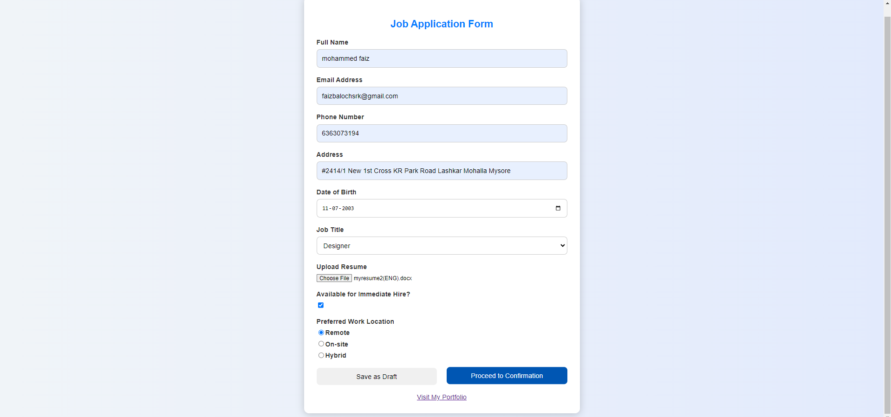

# Task 4: Custom Input Component with Formik and Validation

## Overview
This task involves creating a **custom input component** using **Formik** for form handling, along with **Yup** for validation. The form is flexible and supports various input types with proper validation, including text, email, select, and checkboxes.

## Features
- Custom input component with **Formik** for form handling.
- Integrated validation with **Yup** for each input field.
- Flexible and reusable for different forms.
- Error handling with user-friendly messages.

## Screenshots

### Custom Formik Form Example

## Technologies Used
- **React**
- **Formik**
- **Yup**

## Installation and Setup
1. Clone the repository.
2. Run `npm install` to install dependencies.
3. Start the app with `npm start`.

## How to Use
1. Import the custom component and add it to your form.
2. Define validation schema using **Yup** and pass it to the Formik component.
3. Customize the form by providing necessary fields and validation.

## Files
- `CustomFormikInput.js`: Custom input component for Formik-based forms.
- `ValidationSchema.js`: Defines validation rules for fields using Yup.

## Future Improvements
- Add multi-step form support.
- Extend validation to include more complex rules.
